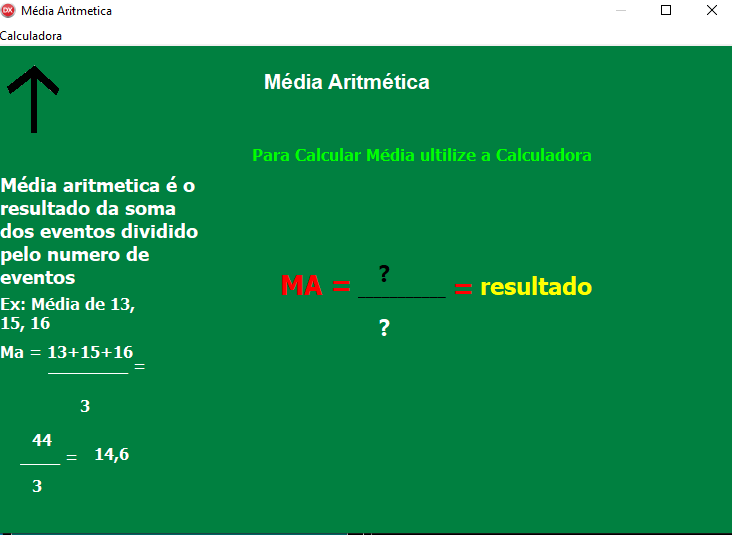

<h1 align="center"> 
  
  
</h1>

## About
- Sistema de calculadora com vários cálculos estatístico

## What is inside?

- [Object Pascal](https://objectpascalprogramming.com/)

## Getting Started

Executar:

```bash
# Abrir com o windows o arquivo .exe
Win32/Debug/statisc-delphi.exe
```
## Learn More

- [Delphi](https://www.embarcadero.com/br/products/delphi) - 
Construa Aplicativos Nativos 5x Mais Rápido para
Windows, Android, iOS, macOS, e Linux